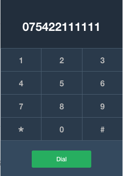
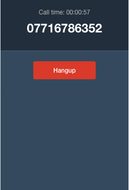

### Frontend CodeTest

Please create a basic dialer UI **component**, implementing the interface as designed in the provided mockup.

The UI should be fully responsive so that the width and height can adapt to different use cases and viewports.

Only the *'Dial'* and *'Hangup'* buttons have a fixed size of 35px X 122px

The initial interface consists of a keypad and an phone number input.

The dial button should switch the UI in to "oncall" state.
Clicking the dial button should emulate a call that lasts 10 seconds.
The "oncall" UI state is provided as follow:  

Clicking the hangup button should terminate the call early, reverting the ui to the initial keypad immediately.

At the end of any call the component should invoke a callback reporting following arguments:

* The total count of calls made
* The 3 most called numbers with call count foreach sorted by call count.

Every call started with the dial button has to be counted against the corresponding phone number.

You can use any tool, library or framework that can help you write production ready code.

For any unclear instruction or missing detail make a reasonable assumption and document accordingly.

To quickly share your solution you can use one of the available online code playground:

* [GitHub](https://github.com)
* [jsFiddle](https://jsfiddle.net)
* [CodePen](https://codepen.io)

Or provide as compressed package.

Please document any build instructions needed to run the solution in a README file.
